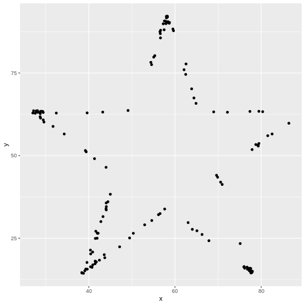
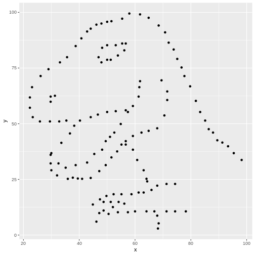
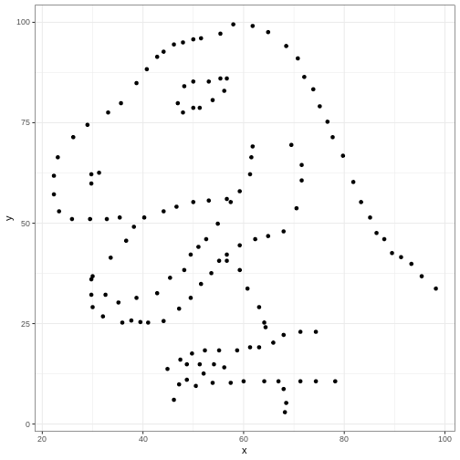
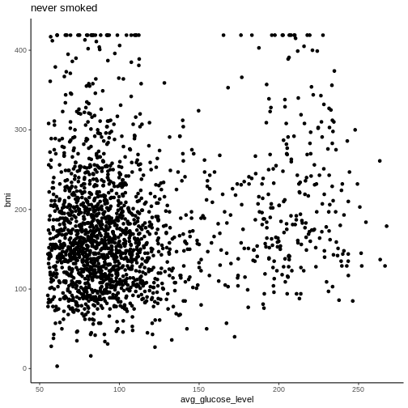
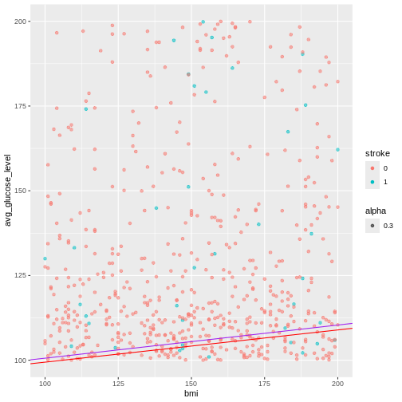
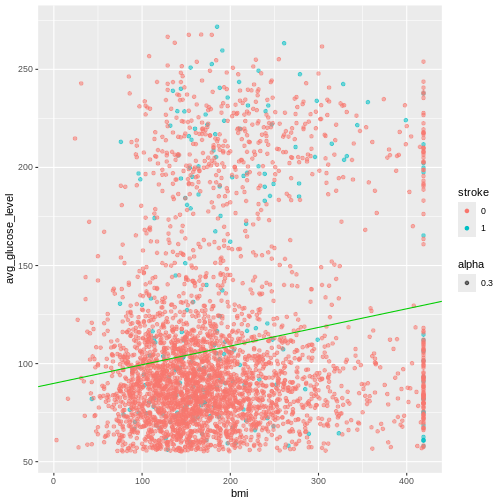
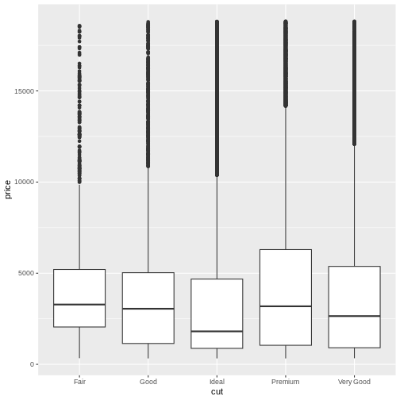

## Lecture Files

*Below is the rendered and completed version of Day 2's R Markdown file.*
*Begin with the empty version [here](https://drive.google.com/file/d/1047GdyOYBlXu3fPHaALMYfy9Tb9o7Tu9/view?usp=sharing).*
*You will also need to download the following datasets:*

- [*Healthcare dataset*](https://drive.google.com/file/d/1d78J0MhMYQj2BpqFwXldZVbonzkTrKCI/view?usp=sharing)
- [*Diamonds dataset*](https://drive.google.com/file/d/1CIxMafo6EVWo_Nk0efmfN4m44_gs217A/view?usp=sharing)

All Introduction to R (2024) course materials are available [here](#course-materials).

## Day 1 Project  

For this mini guided project, we will be working with a dataset quantifying water quality that is publicly available at: https://www.kaggle.com/datasets/adityakadiwal/water-potability?resource=download


Here is some description of the data: 

Access to safe drinking-water is essential to health, a basic human right and a component of effective policy for health protection. This is important as a health and development issue at a national, regional and local level. In some regions, it has been shown that investments in water supply and sanitation can yield a net economic benefit, since the reductions in adverse health effects and health care costs outweigh the costs of undertaking the interventions.
Content

The water_potability.csv file contains water quality metrics for 3276 different water bodies. More information about each of the columns can be found in the link above

pH value
Hardness
Solids (Total dissolved solids - TDS)
Chloramines
Sulfate
Conductivity
Organic_carbon
Trihalomethanes
Turbidity
Potability

Insert a code chunk underneath each step to carry out the instruction. 

1. Read in the "water_potability.csv" data into an object called data Check the object you created by printing out the first 10 rows and applying the summary function.


``` r
data <- read.csv("data/water_potability.csv")

head(data, n=10)
```

``` output
          ph Hardness   Solids Chloramines  Sulfate Conductivity Organic_carbon
1         NA 204.8905 20791.32    7.300212 368.5164     564.3087      10.379783
2   3.716080 129.4229 18630.06    6.635246       NA     592.8854      15.180013
3   8.099124 224.2363 19909.54    9.275884       NA     418.6062      16.868637
4   8.316766 214.3734 22018.42    8.059332 356.8861     363.2665      18.436524
5   9.092223 181.1015 17978.99    6.546600 310.1357     398.4108      11.558279
6   5.584087 188.3133 28748.69    7.544869 326.6784     280.4679       8.399735
7  10.223862 248.0717 28749.72    7.513408 393.6634     283.6516      13.789695
8   8.635849 203.3615 13672.09    4.563009 303.3098     474.6076      12.363817
9         NA 118.9886 14285.58    7.804174 268.6469     389.3756      12.706049
10 11.180284 227.2315 25484.51    9.077200 404.0416     563.8855      17.927806
   Trihalomethanes Turbidity Potability
1         86.99097  2.963135          0
2         56.32908  4.500656          0
3         66.42009  3.055934          0
4        100.34167  4.628771          0
5         31.99799  4.075075          0
6         54.91786  2.559708          0
7         84.60356  2.672989          0
8         62.79831  4.401425          0
9         53.92885  3.595017          0
10        71.97660  4.370562          0
```

``` r
data[1:10, ]
```

``` output
          ph Hardness   Solids Chloramines  Sulfate Conductivity Organic_carbon
1         NA 204.8905 20791.32    7.300212 368.5164     564.3087      10.379783
2   3.716080 129.4229 18630.06    6.635246       NA     592.8854      15.180013
3   8.099124 224.2363 19909.54    9.275884       NA     418.6062      16.868637
4   8.316766 214.3734 22018.42    8.059332 356.8861     363.2665      18.436524
5   9.092223 181.1015 17978.99    6.546600 310.1357     398.4108      11.558279
6   5.584087 188.3133 28748.69    7.544869 326.6784     280.4679       8.399735
7  10.223862 248.0717 28749.72    7.513408 393.6634     283.6516      13.789695
8   8.635849 203.3615 13672.09    4.563009 303.3098     474.6076      12.363817
9         NA 118.9886 14285.58    7.804174 268.6469     389.3756      12.706049
10 11.180284 227.2315 25484.51    9.077200 404.0416     563.8855      17.927806
   Trihalomethanes Turbidity Potability
1         86.99097  2.963135          0
2         56.32908  4.500656          0
3         66.42009  3.055934          0
4        100.34167  4.628771          0
5         31.99799  4.075075          0
6         54.91786  2.559708          0
7         84.60356  2.672989          0
8         62.79831  4.401425          0
9         53.92885  3.595017          0
10        71.97660  4.370562          0
```


2. Notice that the pH column contains a couple hundred NA values. NA are special values in R (like how "pi" is preset to a value of 3.14159...) to indicate that there is missing data, or it is not available. There are also some NAs in the Sulfate and Trihalomethanes columns.

Create new object called water_df that only contains complete observations.

Hint: take a look at the function called `na.omit()`. In most cases, someone's already done what you've wanted to do so there may already be code or functions that you can adapt and use!


``` r
water_df <- na.omit(data)
summary(data)
```

``` output
       ph            Hardness          Solids         Chloramines    
 Min.   : 0.000   Min.   : 47.43   Min.   :  320.9   Min.   : 0.352  
 1st Qu.: 6.093   1st Qu.:176.85   1st Qu.:15666.7   1st Qu.: 6.127  
 Median : 7.037   Median :196.97   Median :20927.8   Median : 7.130  
 Mean   : 7.081   Mean   :196.37   Mean   :22014.1   Mean   : 7.122  
 3rd Qu.: 8.062   3rd Qu.:216.67   3rd Qu.:27332.8   3rd Qu.: 8.115  
 Max.   :14.000   Max.   :323.12   Max.   :61227.2   Max.   :13.127  
 NA's   :491                                                         
    Sulfate       Conductivity   Organic_carbon  Trihalomethanes  
 Min.   :129.0   Min.   :181.5   Min.   : 2.20   Min.   :  0.738  
 1st Qu.:307.7   1st Qu.:365.7   1st Qu.:12.07   1st Qu.: 55.845  
 Median :333.1   Median :421.9   Median :14.22   Median : 66.622  
 Mean   :333.8   Mean   :426.2   Mean   :14.28   Mean   : 66.396  
 3rd Qu.:360.0   3rd Qu.:481.8   3rd Qu.:16.56   3rd Qu.: 77.337  
 Max.   :481.0   Max.   :753.3   Max.   :28.30   Max.   :124.000  
 NA's   :781                                     NA's   :162      
   Turbidity       Potability    
 Min.   :1.450   Min.   :0.0000  
 1st Qu.:3.440   1st Qu.:0.0000  
 Median :3.955   Median :0.0000  
 Mean   :3.967   Mean   :0.3901  
 3rd Qu.:4.500   3rd Qu.:1.0000  
 Max.   :6.739   Max.   :1.0000  
                                 
```

``` r
summary(water_df)
```

``` output
       ph             Hardness          Solids         Chloramines    
 Min.   : 0.2275   Min.   : 73.49   Min.   :  320.9   Min.   : 1.391  
 1st Qu.: 6.0897   1st Qu.:176.74   1st Qu.:15615.7   1st Qu.: 6.139  
 Median : 7.0273   Median :197.19   Median :20933.5   Median : 7.144  
 Mean   : 7.0860   Mean   :195.97   Mean   :21917.4   Mean   : 7.134  
 3rd Qu.: 8.0530   3rd Qu.:216.44   3rd Qu.:27182.6   3rd Qu.: 8.110  
 Max.   :14.0000   Max.   :317.34   Max.   :56488.7   Max.   :13.127  
    Sulfate       Conductivity   Organic_carbon  Trihalomethanes  
 Min.   :129.0   Min.   :201.6   Min.   : 2.20   Min.   :  8.577  
 1st Qu.:307.6   1st Qu.:366.7   1st Qu.:12.12   1st Qu.: 55.953  
 Median :332.2   Median :423.5   Median :14.32   Median : 66.542  
 Mean   :333.2   Mean   :426.5   Mean   :14.36   Mean   : 66.401  
 3rd Qu.:359.3   3rd Qu.:482.4   3rd Qu.:16.68   3rd Qu.: 77.292  
 Max.   :481.0   Max.   :753.3   Max.   :27.01   Max.   :124.000  
   Turbidity       Potability    
 Min.   :1.450   Min.   :0.0000  
 1st Qu.:3.443   1st Qu.:0.0000  
 Median :3.968   Median :0.0000  
 Mean   :3.970   Mean   :0.4033  
 3rd Qu.:4.514   3rd Qu.:1.0000  
 Max.   :6.495   Max.   :1.0000  
```


``` r
dim(data)
```

``` output
[1] 3276   10
```

``` r
dim(water_df)
```

``` output
[1] 2011   10
```


3. The Potability column has two possible values: 1 means Potable and 0 means Not potable.

It is read in by default as a character vector. Convert this column to a factor.


``` r
water_df$Potability <- as.factor(water_df$Potability)
head(water_df)
```

``` output
          ph Hardness   Solids Chloramines  Sulfate Conductivity Organic_carbon
4   8.316766 214.3734 22018.42    8.059332 356.8861     363.2665      18.436524
5   9.092223 181.1015 17978.99    6.546600 310.1357     398.4108      11.558279
6   5.584087 188.3133 28748.69    7.544869 326.6784     280.4679       8.399735
7  10.223862 248.0717 28749.72    7.513408 393.6634     283.6516      13.789695
8   8.635849 203.3615 13672.09    4.563009 303.3098     474.6076      12.363817
10 11.180284 227.2315 25484.51    9.077200 404.0416     563.8855      17.927806
   Trihalomethanes Turbidity Potability
4        100.34167  4.628771          0
5         31.99799  4.075075          0
6         54.91786  2.559708          0
7         84.60356  2.672989          0
8         62.79831  4.401425          0
10        71.97660  4.370562          0
```

``` r
table(water_df$Potability)
```

``` output

   0    1 
1200  811 
```


4. WHO has recommended maximum permissible limit of pH in drinking water from 6.5 to 8.5.

Create a new column within the `water_df` object called `ph_category` in which:

- Observations with a pH less than 6.5 have a value of `acidic` in the `ph_category`
- Observations with a pH betwee 6.5 - 8.5 have a value of `permissible` in the `ph_category`
- Observations with a pH greater than 8.5 have a value of `basic` in the `ph_category`

There are multiple ways to do this, give it a go! You can't break the object - if you ever feel like you need a reset, you can always repeat step 1 to read in the object again.

Use `table()` or `summary()` to check the values in the `ph_category` column


``` r
water_df$ph_category <- "permissible"

water_df$ph_category[water_df$ph < 6.5] <- "acidic"

water_df$ph_category[water_df$ph > 8.5] <- "basic"

table(water_df$ph_category)
```

``` output

     acidic       basic permissible 
        692         358         961 
```

``` r
nrow(water_df[water_df$ph <6.5, ])
```

``` output
[1] 692
```


5. Create a plot to double check if the annotations in the `ph_category` column were applied correctly. Make sure to represent both the `ph` and `ph_category` columns.

You're welcome to use base R or ggplot functions. There are multiple ways of representing these two columns. ggplot is slightly preferred because of its increased customization so it's good to get some practice with it!


``` r
library(ggplot2)
ggplot(water_df, aes(x=ph_category, y=ph)) +
  geom_boxplot()
```


6. The levels of sulfates and water hardness cause by salts should be minimized in order to be safe for consumption.

Create a plot with the level of water hardness on the x axis and sulphate on the y axis colored by the Potability column.

Try applying the `facet_grid()` layer to the plot in order to group the plots by a factor. Make sure to use the `~` before the column name!

(Note - the data is quite messy so don't worry if the results do not separate as much as you would like - real data is messy!)


``` r
ggplot(water_df, aes(x = Hardness, y = Sulfate, col = Potability)) +
  geom_point() +
  facet_wrap(~ph_category) + theme_bw()
```


## Review with Datasaurus Dozen

The Datasaurus Dozen dataset is a handful of data points that complement the `dplyr` package. Aside from functions, packages can also import objects.


``` r
#install.packages("datasauRus")
library(datasauRus)
library(tidyverse)
```

``` output
── Attaching core tidyverse packages ──────────────────────── tidyverse 2.0.0 ──
✔ dplyr     1.1.4     ✔ readr     2.1.5
✔ forcats   1.0.0     ✔ stringr   1.5.1
✔ lubridate 1.9.3     ✔ tibble    3.2.1
✔ purrr     1.0.2     ✔ tidyr     1.3.1
── Conflicts ────────────────────────────────────────── tidyverse_conflicts() ──
✖ dplyr::filter() masks stats::filter()
✖ dplyr::lag()    masks stats::lag()
ℹ Use the conflicted package (<http://conflicted.r-lib.org/>) to force all conflicts to become errors
```


``` r
summary(datasaurus_dozen)
```

``` output
   dataset                x               y           
 Length:1846        Min.   :15.56   Min.   : 0.01512  
 Class :character   1st Qu.:41.07   1st Qu.:22.56107  
 Mode  :character   Median :52.59   Median :47.59445  
                    Mean   :54.27   Mean   :47.83510  
                    3rd Qu.:67.28   3rd Qu.:71.81078  
                    Max.   :98.29   Max.   :99.69468  
```

``` r
datasaurus_dozen$dataset <- as.factor(datasaurus_dozen$dataset)

tail(datasaurus_dozen)
```

``` output
# A tibble: 6 × 3
  dataset        x     y
  <fct>      <dbl> <dbl>
1 wide_lines  34.7  19.6
2 wide_lines  33.7  26.1
3 wide_lines  75.6  37.1
4 wide_lines  40.6  89.1
5 wide_lines  39.1  96.5
6 wide_lines  34.6  89.6
```

``` r
table(datasaurus_dozen$dataset)
```

``` output

      away   bullseye     circle       dino       dots    h_lines high_lines 
       142        142        142        142        142        142        142 
slant_down   slant_up       star    v_lines wide_lines    x_shape 
       142        142        142        142        142        142 
```

There are 13 different datasets in this one object. We will use tidyverse functions to take an overview look at the object, grouped by the datasets.


``` r
datasaurus_dozen %>%
  group_by(dataset) %>%
  summarize(mean_x = mean(x),
            mean_y = mean(y),
            std_dev_x = sd(x),
            std_dev_y = sd(y))
```

``` output
# A tibble: 13 × 5
   dataset    mean_x mean_y std_dev_x std_dev_y
   <fct>       <dbl>  <dbl>     <dbl>     <dbl>
 1 away         54.3   47.8      16.8      26.9
 2 bullseye     54.3   47.8      16.8      26.9
 3 circle       54.3   47.8      16.8      26.9
 4 dino         54.3   47.8      16.8      26.9
 5 dots         54.3   47.8      16.8      26.9
 6 h_lines      54.3   47.8      16.8      26.9
 7 high_lines   54.3   47.8      16.8      26.9
 8 slant_down   54.3   47.8      16.8      26.9
 9 slant_up     54.3   47.8      16.8      26.9
10 star         54.3   47.8      16.8      26.9
11 v_lines      54.3   47.8      16.8      26.9
12 wide_lines   54.3   47.8      16.8      26.9
13 x_shape      54.3   47.8      16.8      26.9
```

All of the datasets have roughly the same mean and standard deviation along both the x and y axis.

Let's take a look the data graphically. We will use `filter` to extract the rows belonging to one dataset and then pipe that directly into a ggplot. Both dplyr and ggplot are developed within "the Tidyverse" and can use pipes, but you may not be able to pipe in base R functions or functions from different packages.


``` r
datasaurus_dozen %>%
  filter(dataset == "star") %>%
  ggplot(aes(x=x, y=y)) + # PLUS SIGN, NOT PIPE FOR THIS ONE
  geom_point()
```



Tidyverse's data wranging packages use the pipe ` %>% ` to move the previous output to the next line, where as ggplot uses the plus sign `+`

Try editing the code above to display different datasets. Notice how different groups of data points can all give similar statistical summaries - so it's always a good choice to visualize your data rather than relying on just numbers.

If we wanted to take a look at all of the datasets at once, we can also use the `facet_wrap()` function.


``` r
datasaurus_dozen %>%
  #filter(dataset == "star") %>%  REMOVE THIS ROW
  ggplot(aes(x=x, y=y)) +
  geom_point() +
  facet_wrap(~dataset)+ theme_void() # ADD THIS LINE
```


``` r
head(datasaurus_dozen)
```

``` output
# A tibble: 6 × 3
  dataset     x     y
  <fct>   <dbl> <dbl>
1 dino     55.4  97.2
2 dino     51.5  96.0
3 dino     46.2  94.5
4 dino     42.8  91.4
5 dino     40.8  88.3
6 dino     38.7  84.9
```

### Genearlizable code

A major strength of programming is the ability to automate repetitive tasks. As a general rule of thumb, if you need to do a task more than three times (ex. analyzing multiple PCR plates or integrating clinical data from multiple days), it is worth it to invest time to write generalizable code or a custom function.

Now that we're getting comfortable writing code, we will spend some time revisiting code that we wrote to make them generalizable and even better! Generalizable means that the code is flexible and can be applied to multiple similar objects. For example, if we're running a clinical study and we have patient demographic data from multiple sites, we want to check that the mean patient demographic is comparable between sites by creating similar plots of each hospital site to compare. If we write code for one location and then copy and paste it into another code chunk to apply to the next location, the code may require some modification before it works.

Generalizable code begins at data collection. Depending on your workflow, you may or may not be able to influence this stage of the analysis. If possible, it is best practice to keep the column names and entries for categorical variables consistent. For example, when recording the age of patients, "6", "6 ", "six", and "Six" are all considered different levels of the factor so you will need to either make sure data collection is consistent or check and correct these inconsistencies in your code. Get into a habit of checking your work. Whether it is code you've written yourself, code you you've been sent by a collaborator, or published data from a biobank - never assume the data is as you predicted.

## Generalizable plots

Remember when we edited our code to test out multiple datasets in the datasaurus dozen object? Perhaps you copy and pasted the code several time and changed the column name? This is not optimal because if you need to change the code in one instance (for example changing the x-axis label), you'll need to revisit ever instance that you copy and pasted to code to. This approach leads you vulnerable to errors when copy and pasting.

One way to make your code robust is to bring all the factors that need editing to the start of the data. This may seem cumbersome for such a simple example where we are only changing the dataset name, but we'll return to this concept later with more complicated examples.

Let's grab the code we used to make one plot earlier and modify it to be more generalizable


``` r
levels(datasaurus_dozen$dataset)
```

``` output
 [1] "away"       "bullseye"   "circle"     "dino"       "dots"      
 [6] "h_lines"    "high_lines" "slant_down" "slant_up"   "star"      
[11] "v_lines"    "wide_lines" "x_shape"   
```


``` r
dataset_name <- "dino" # ADD THIS LINE

datasaurus_dozen %>%
  filter(dataset == dataset_name) %>% # Remove comment # CHANGE VARIABLE NAME
  ggplot(aes(x=x, y=y)) +
  geom_point() # REMOVE THE + at the end of the line
```



Once we have converted our code to a generalized format, we can convert it into a more versatile custom function!

Curly brackets are used for inputting multiple lines of code. It is generally attached to the function that proceeds it.


``` r
# dataset_name <- "dino" # ADD THIS LINE

dino_plot <- function(data_name) {
  datasaurus_dozen %>%
    filter(dataset == data_name) %>% # CHANGE ARGUMENT NAME

    ggplot(aes(x=x, y=y)) +
    geom_point() +
    theme_bw()
}

dino_plot("dino")
```



``` r
dino_plot("circle")
```


### Exercise

We've now encountered round brackets `()`, square brackets `[]`, and curly brackets`{}` - each have their own distinct functions! Take a few moments to chat with your neighbors and outline cases in which we've used each bracket and what is their role in R syntax.

round brackets ()
come after a function, function will apply to whatever is in the brackets
functionName(what is being acted on)

square brackets []
Indexing, locations
object[position]
dataframe[rows, cols]

curly brackets {}
Used in function, indicate multiple lines of related code
Rmd -- indicates language in code chunk


### Dataset - Heart Stroke Preduction

The dataset we will be working with for today's workshop contains clinical data collected with the aim of predicting whether a patient is likely to suffer a stroke.

The dataset can be found: https://www.kaggle.com/datasets/fedesoriano/stroke-prediction-dataset

Here is some more information about the columns in this dataset:

1) id: unique identifier
2) gender: "Male", "Female" or "Other"
3) age: age of the patient
4) hypertension: 0 if the patient doesn't have hypertension, 1 if the patient has hypertension
5) heart_disease: 0 if the patient doesn't have any heart diseases, 1 if the patient has a heart disease
6) ever_married: "No" or "Yes"
7) work_type: "children", "Govt_jov", "Never_worked", "Private" or "Self-employed"
8) Residence_type: "Rural" or "Urban"
9) avg_glucose_level: average glucose level in blood
10) bmi: body mass index
11) smoking_status: "formerly smoked", "never smoked", "smokes" or "Unknown"*
12) stroke: 1 if the patient had a stroke or 0 if not
*Note: "Unknown" in smoking_status means that the information is unavailable for this patient

Let's get started!

### Exercise

Reading in the dataset can be an intimidating step when you're just starting out with programming. Since this is a csv file, we can use the appropriately named `read.csv()` function. In cases when you have other file types such as .txt or .tab files that are tab deliminated, there is also a `read.table()` function that is more universal (but requires more parameters to let R know how your data is stored).

Read in the `healthcare-dataset-stroke-data.csv` into an object called `heart`. Check your object using head and/or summary functions. Toggle a parameter called `stringsAsFactors` to `TRUE` in order to automatically import character values as factors rather than characters

Hint: make sure the dataset is in the same directory or folder as this .Rmd file for ease of import


``` r
heart <- read.csv("data/healthcare-dataset-stroke-data.csv", stringsAsFactors=TRUE)

head(heart)
```

``` output
     id gender age hypertension heart_disease ever_married     work_type
1  9046   Male  67            0             1          Yes       Private
2 51676 Female  61            0             0          Yes Self-employed
3 31112   Male  80            0             1          Yes       Private
4 60182 Female  49            0             0          Yes       Private
5  1665 Female  79            1             0          Yes Self-employed
6 56669   Male  81            0             0          Yes       Private
  Residence_type avg_glucose_level  bmi  smoking_status stroke
1          Urban            228.69 36.6 formerly smoked      1
2          Rural            202.21  N/A    never smoked      1
3          Rural            105.92 32.5    never smoked      1
4          Urban            171.23 34.4          smokes      1
5          Rural            174.12   24    never smoked      1
6          Urban            186.21   29 formerly smoked      1
```

``` r
str(heart)
```

``` output
'data.frame':	5110 obs. of  12 variables:
 $ id               : int  9046 51676 31112 60182 1665 56669 53882 10434 27419 60491 ...
 $ gender           : Factor w/ 6 levels "female","Female",..: 4 2 4 2 2 4 4 2 2 2 ...
 $ age              : num  67 61 80 49 79 81 74 69 59 78 ...
 $ hypertension     : Factor w/ 4 levels "0","1","10","10+D4972": 1 1 1 1 2 1 2 1 1 1 ...
 $ heart_disease    : int  1 0 1 0 0 0 1 0 0 0 ...
 $ ever_married     : Factor w/ 2 levels "No","Yes": 2 2 2 2 2 2 2 1 2 2 ...
 $ work_type        : Factor w/ 8 levels "children","Govt_job",..: 5 7 5 5 7 5 5 5 5 5 ...
 $ Residence_type   : Factor w/ 2 levels "Rural","Urban": 2 1 1 2 1 2 1 2 1 2 ...
 $ avg_glucose_level: num  229 202 106 171 174 ...
 $ bmi              : Factor w/ 419 levels "10.3","11.3",..: 240 419 199 218 114 164 148 102 419 116 ...
 $ smoking_status   : Factor w/ 4 levels "formerly smoked",..: 1 2 2 3 2 1 2 2 4 4 ...
 $ stroke           : int  1 1 1 1 1 1 1 1 1 1 ...
```

``` r
# Hypertension has values that are typos, need to be removed
table(heart$hypertension)
```

``` output

       0        1       10 10+D4972 
    4612      493        4        1 
```

``` r
# Stroke and heart.disease need to be categorical
summary(heart$stroke)
```

``` output
   Min. 1st Qu.  Median    Mean 3rd Qu.    Max. 
0.00000 0.00000 0.00000 0.04873 0.00000 1.00000 
```

``` r
# Gender has some variability
table(heart$gender)
```

``` output

female Female   male   Male   meal  Other 
     7   2987      6   2108      1      1 
```

``` r
# Abnormal BMI value AND convert from factor to numeric
summary(heart$bmi)
```

``` output
    N/A    28.7    28.4    26.1    26.7    27.6    27.7    23.4    27.3      27 
    201      41      38      37      37      37      37      36      36      35 
   25.1    26.4    26.9    25.5    23.5    24.8    28.9    22.2    26.5    28.3 
     34      34      34      33      31      31      31      30      30      30 
   29.4    30.3    31.4    24.2    26.6    27.5    28.1    29.1      24    24.1 
     30      30      30      29      29      29      29      29      28      28 
   25.3    27.1    27.9      28    32.3    21.5      23    24.9      25    26.2 
     28      28      28      28      28      27      27      27      27      27 
   28.5    28.6    29.7      30    30.9    31.5    24.3    24.5    25.4    28.8 
     27      27      27      27      27      27      26      26      26      26 
     29    29.2    29.5    29.6    29.9    30.1    31.1    20.1    22.7    22.8 
     26      26      26      26      26      26      26      25      25      25 
     26    28.2    32.8    33.1    23.6    23.9    25.8    25.9    27.2    30.5 
     25      25      25      25      24      24      24      24      24      24 
   31.8    32.1    35.8    20.4    24.4    26.3    27.8    29.8    30.7    33.5 
     24      24      24      23      23      23      23      23      23      23 
   21.4    22.1    22.4    23.8    24.6    24.7    27.4    29.3      31    31.9 
     22      22      22      22      22      22      22      22      22      22 
   19.5    21.3    23.1    25.6    26.8    30.8    31.3    31.6      32 (Other) 
     21      21      21      21      21      21      21      21      21    2282 
```

``` r
# Age, very low value of 0.08
str(heart)
```

``` output
'data.frame':	5110 obs. of  12 variables:
 $ id               : int  9046 51676 31112 60182 1665 56669 53882 10434 27419 60491 ...
 $ gender           : Factor w/ 6 levels "female","Female",..: 4 2 4 2 2 4 4 2 2 2 ...
 $ age              : num  67 61 80 49 79 81 74 69 59 78 ...
 $ hypertension     : Factor w/ 4 levels "0","1","10","10+D4972": 1 1 1 1 2 1 2 1 1 1 ...
 $ heart_disease    : int  1 0 1 0 0 0 1 0 0 0 ...
 $ ever_married     : Factor w/ 2 levels "No","Yes": 2 2 2 2 2 2 2 1 2 2 ...
 $ work_type        : Factor w/ 8 levels "children","Govt_job",..: 5 7 5 5 7 5 5 5 5 5 ...
 $ Residence_type   : Factor w/ 2 levels "Rural","Urban": 2 1 1 2 1 2 1 2 1 2 ...
 $ avg_glucose_level: num  229 202 106 171 174 ...
 $ bmi              : Factor w/ 419 levels "10.3","11.3",..: 240 419 199 218 114 164 148 102 419 116 ...
 $ smoking_status   : Factor w/ 4 levels "formerly smoked",..: 1 2 2 3 2 1 2 2 4 4 ...
 $ stroke           : int  1 1 1 1 1 1 1 1 1 1 ...
```

Before we dive into this dataset, we get a very limited indication that the object is read in correctly by checking the Environment panel - you'll notice the new `heart` appears under Data and it lets us know that there are 5110 observations (number of patients) and 12 variables (number of clinical features with entries). You can also double click the name of the object here to open up a view of the whole dataset - caution that this can cause your machine to stall if the dataset is exceptionally large and/or your machine is running on minimal memory.

### Exercise

Explore the dataset! Take a look at the columns and identify some potential issues with this dataset that either warrant further investigation or correction.

There is no universally right or wrong way to do this. Perhaps the only truly incorrect way of doing this is going through the dataset which is thousands of observations line by line.


## Factors

The `stringsAsFactors` parameter takes care of the character values but we still have some integer values that should be interpreted as factors.

When deciding on whether a number is a factor or should be kept numeric, consider if decimals/numbers-in-between make sense. The first two entries for `avg_glucose_level` are 229 and 202 - a glucose level in between would be reasonable. In contrast, the first to entries for `heart_disease` are 1 and 0 - as these are coding for having or not having the disorder, an entry of 1.2 does not make sense.

Recall from the introduction to the dataset from above:
4) hypertension: 0 if the patient doesn't have hypertension, 1 if the patient has hypertension
5) heart_disease: 0 if the patient doesn't have any heart diseases, 1 if the patient has a heart disease
12) stroke: 1 if the patient had a stroke or 0 if not


``` r
heart$hypertension <- as.factor(heart$hypertension)
heart$heart_disease <- as.factor(heart$heart_disease)
heart$stroke <- as.factor(heart$stroke)

summary(heart)
```

``` output
       id           gender          age          hypertension  heart_disease
 Min.   :   67   female:   7   Min.   : 0.08   0       :4612   0:4834       
 1st Qu.:17741   Female:2987   1st Qu.:25.00   1       : 493   1: 276       
 Median :36932   male  :   6   Median :45.00   10      :   4                
 Mean   :36518   Male  :2108   Mean   :43.23   10+D4972:   1                
 3rd Qu.:54682   meal  :   1   3rd Qu.:61.00                                
 Max.   :72940   Other :   1   Max.   :82.00                                
                                                                            
 ever_married         work_type    Residence_type avg_glucose_level
 No :1757     Private      :2921   Rural:2514     Min.   : 55.12   
 Yes:3353     Self-employed: 818   Urban:2596     1st Qu.: 77.25   
              children     : 687                  Median : 91.89   
              Govt_job     : 656                  Mean   :106.15   
              Never_worked :  22                  3rd Qu.:114.09   
              Private      :   4                  Max.   :271.74   
              (Other)      :   2                                   
      bmi               smoking_status stroke  
 N/A    : 201   formerly smoked: 885   0:4861  
 28.7   :  41   never smoked   :1892   1: 249  
 28.4   :  38   smokes         : 789           
 26.1   :  37   Unknown        :1544           
 26.7   :  37                                  
 27.6   :  37                                  
 (Other):4719                                  
```


### Incomplete data

Firstly, we have to make a decision on how to handle missing values. We can either accept that some of the columns are incomplete or eliminate rows that do not have full data. Let's evaluate which columns this affects

If you ever encounter missing data when you are entering data, use `NA`.


``` r
ggplot(heart, aes(x = smoking_status, fill = hypertension)) +
  geom_bar()
```


``` r
prop.table(table(heart$smoking_status, heart$hypertension))
```

``` output
                 
                             0            1           10     10+D4972
  formerly smoked 0.1497064579 0.0232876712 0.0001956947 0.0000000000
  never smoked    0.3248532290 0.0448140900 0.0003913894 0.0001956947
  smokes          0.1360078278 0.0183953033 0.0000000000 0.0000000000
  Unknown         0.2919765166 0.0099804305 0.0001956947 0.0000000000
```

Let's use tidyverse to remove the rows in the `smoking_status` column with a value of `Unknown`.


``` r
dim(heart) # original 5110 rows
```

``` output
[1] 5110   12
```

``` r
table(heart$smoking_status) #1544 unknowns
```

``` output

formerly smoked    never smoked          smokes         Unknown 
            885            1892             789            1544 
```

``` r
dim(filter(heart, !(smoking_status == "Unknown")))
```

``` output
[1] 3566   12
```

``` r
heart <- filter(heart, !(smoking_status == "Unknown"))
summary(heart$smoking_status)
```

``` output
formerly smoked    never smoked          smokes         Unknown 
            885            1892             789               0 
```

After double checking, we can see that the smoking status has an empty level, we'll clean this up before moving on


``` r
heart$smoking_status <- droplevels(heart$smoking_status)

summary(heart$smoking_status)
```

``` output
formerly smoked    never smoked          smokes 
            885            1892             789 
```

``` r
heart_checkpoint <- heart
```

Great! Now let's tackle the typos in the gender column.


``` r
table(heart$gender)
```

``` output

female Female   male   Male   meal  Other 
     5   2153      5   1402      0      1 
```

We need to fix the typos that happened during data entry and the single observation of `Other` will not be enough data for us to draw any statistical conclusion so we'll remove this row while we're at it.

We can use `str_replace_all()` as a search and replace tool


``` r
table(str_replace_all(heart$gender, "female", "Female"))
```

``` output

Female   male   Male  Other 
  2158      5   1402      1 
```

``` r
# str_replace_all(data, what we're search, what to replace with)
```
Remember that this only displays the output, it does not replace the columns in the dataset.

Before we apply it globally, we can set up a quick double check to make sure that the right values are changed.


``` r
# document which rows have the error "female"
wrong_entry <- which(heart$gender == "female")
wrong_entry
```

``` output
[1]  127  271  941 1930 3021
```

``` r
heart$gender[wrong_entry]
```

``` output
[1] female female female female female
Levels: female Female male Male meal Other
```

``` r
# apply the search and replace
heart$gender <- str_replace_all(heart$gender, c("female" = "Female",
                                                "male" = "Male",
                                                "meal" = "Male"))

heart$gender[wrong_entry]
```

``` output
[1] "FeMale" "FeMale" "FeMale" "FeMale" "FeMale"
```

``` r
table(heart$gender)
```

``` output

FeMale   Male  Other 
  2158   1407      1 
```

There's an issue with the "male" search grabbing from the "female" word!! Good thing we made a checkpoint earlier. Let's bring this back to our main heart object - it's a good habit to make some objects to checkpoint your work. In case you have not had this set up, you can always back track in your code and re-read in the object and re-run some earlier code to catch up.


``` r
heart <- heart_checkpoint

table(heart$gender)
```

``` output

female Female   male   Male   meal  Other 
     5   2153      5   1402      0      1 
```

Let's try this again:


``` r
# From previous code

# add ^ (carrot) to the start of the search term to make sure it's only found at the start of the word
heart$gender <- str_replace_all(heart$gender, c("^female" = "Female",
                                                "^male" = "Male",
                                                "^meal" = "Male"))

heart$gender[wrong_entry]
```

``` output
[1] "Female" "Female" "Female" "Female" "Female"
```

``` r
table(heart$gender)
```

``` output

Female   Male  Other 
  2158   1407      1 
```

The `^` is a special character that indicates the start of a word.

Lastly, we'll the one `Other` entry


``` r
heart <- heart[!heart$gender == "Other", ] # object[rows, col]
table(heart$gender)
```

``` output

Female   Male 
  2158   1407 
```

Overall, the data is looking much cleaner than when we started!

### Exercise

Investigate the `work_type` column and correct the data entry problems! Also, remove any "N/A" entries under `bmi`


``` r
table(heart$work_type)
```

``` output

      children       Govt_job      Govt_job    Never_worked        Private 
            69            534              1             14           2281 
      Private   Self-employed Self-employed  
             3            662              1 
```

``` r
levels(heart$work_type)
```

``` output
[1] "children"       "Govt_job"       "Govt_job "      "Never_worked"  
[5] "Private"        "Private "       "Self-employed"  "Self-employed "
```

``` r
heart$work_type <- str_replace_all(heart$work_type, c("Govt_job " = "Govt_job",
                                                      "Private " = "Private",
                                                      "Self-employed " = "Self-employed"))

class(heart$work_type)
```

``` output
[1] "character"
```

``` r
heart$work_type <- as.factor(heart$work_type)
```

``` r
summary(heart$bmi)
```

``` output
    N/A    28.4    28.7      27    27.6    25.5    27.3    26.1    26.7    26.9 
    140      32      32      30      30      28      28      26      26      26 
   32.3    25.1    25.3    26.4    26.5    27.7    28.3    28.9      29    29.6 
     26      25      25      25      25      25      25      24      24      24 
   30.3    30.9    31.4    23.4      28    28.1    28.6    29.4    23.5    26.6 
     24      24      24      23      23      23      23      23      22      22 
   27.1    27.5    28.2    28.5    29.5    31.1    22.2    24.5      25    26.2 
     22      22      22      22      22      22      21      21      21      21 
   27.9    29.2    29.9      30    30.5    30.7    31.5    32.1      24    24.1 
     21      21      21      21      21      21      21      21      20      20 
   24.2    24.3    24.8      26    27.2    30.1    33.1    35.8    24.9    25.4 
     20      20      20      20      20      20      20      20      19      19 
   28.8    29.7    31.3    32.8    24.4    26.3    27.8    33.7    21.5    22.8 
     19      19      19      19      18      18      18      18      17      17 
   23.1    23.8    27.4    29.3      31    31.6    31.8    34.7    21.3    22.1 
     17      17      17      17      17      17      17      17      16      16 
   22.7      23    23.9    24.6    24.7    25.8    25.9    26.8    29.1    29.8 
     16      16      16      16      16      16      16      16      16      16 
   30.2    30.8    31.2    31.9    32.4    33.5    34.5    23.6    32.2 (Other) 
     16      16      16      16      16      16      16      15      15    1414 
```

``` r
heart$bmi <- as.numeric(heart$bmi)
summary(heart$bmi)
```

``` output
   Min. 1st Qu.  Median    Mean 3rd Qu.    Max. 
    3.0   128.0   168.0   185.6   223.0   419.0 
```


### Loops

"For loops" allow R to apply highly automated tasks. It will cycle through a range of inputs and "for" each of them, it will carry out your custom task.

Here's a very simple example to show you the structure of for loops


``` r
fruits <- c("strawberry", "banana", "orange")

for(x in fruits) {
  print(x)
}
```

``` output
[1] "strawberry"
[1] "banana"
[1] "orange"
```
The `for()` function accepts firstly the name of a temporary object that exists only within the curly brackets of the for loop, the `in` is a special R syntax specification, and `fruit` is the object that we are applying the for loop on.

The for loop will take each entry of the fruits object, store it in the temporary object `x`, and apply the code written written within the curly bracket before repeating with the next entry.

I recommend testing your code outside the `for()` loop before moving it into the loop to make sure it is robust and if you are applying the loop to a long vector or large dataset, consider trying it on a truncated version first as a proof of principle.


``` r
levels(heart$smoking_status)
```

``` output
[1] "formerly smoked" "never smoked"    "smokes"         
```

``` r
heart %>%
  filter(smoking_status == "never smoked") %>%
  ggplot(aes(x=avg_glucose_level, y=bmi)) +
  geom_point() +
  ggtitle("never smoked") +
  theme_classic()
```



If we wanted to save a pdf of every category of `smoking_status`, we can convert our code into a loop. When working on a larger section of code, it is helpful to sketch out the steps you need to do with `#` comments to keep you focused.


``` r
smoke_cat <- levels(heart$smoking_status)
smoke_cat
```

``` output
[1] "formerly smoked" "never smoked"    "smokes"         
```

``` r
getwd() # get working directory
```

``` output
[1] "/home/runner/work/INR_2024_Recreate_Carpentries/INR_2024_Recreate_Carpentries/site/built"
```

``` r
for(cat in smoke_cat) {

  # Specify file name
  filename_cat <- paste0("bmi_glucose_", cat, ".png")
  print(filename_cat)

  # Making plot (based on code from above)

  plot_cat <- heart %>% # SAVE OUTPUT TO OBJECT
  filter(smoking_status == cat) %>% # CHANGE TO cat
  ggplot(aes(x=avg_glucose_level, y=bmi)) +
  geom_point() +
  ggtitle(cat) + # CHANGE TO cat
  theme_classic()

  #print(plot_cat) # PRINT OUT PLOT

  # Saving the plot to file
  png(filename_cat, width = 700, height= 500, res=120) # Start saving whatever I make now to this file
  print(plot_cat)
  dev.off() # Stop saving
}
```

``` output
[1] "bmi_glucose_formerly smoked.png"
```

``` output
[1] "bmi_glucose_never smoked.png"
```

``` output
[1] "bmi_glucose_smokes.png"
```


### Exercise

Copy and paste the loop from  above and modify it so that the range of values on the x and y axis are the same for all plots.

Hint: the limits of the x axis can be specified by adding a layer called `xlim(lower, upper)` where it takes two numbers - the lower limit followed by the upper limit. These numbers can be stored in objects or inputted directly . Similarly, there is a parallel function called `ylim()` which also takes the same two parameters

When working through the code, you can temporarily remove the code removing the axis labels by commenting out the lines with a hashtag.


Great! Now the y-axis does not change between the plots and they are directly comparable.

### Conditional for loops

Boolean statements can be used to write conditional statements. If we do not want the loop to be applied to every item, we can add a condition.


``` r
food <- "pineapple"

if(food == "pineapple") {
  print("This indeed is a pineapple.")
}
```

``` output
[1] "This indeed is a pineapple."
```

This will only output if the condition is met. We can also modify this statement to do something in case the condition is not met.


``` r
food <- "orange"

if(food == "pineapple") {
  print("This indeed is a pineapple.")
} else {
  print("This is NOT a pineapple.")
}
```

``` output
[1] "This is NOT a pineapple."
```
Using `if else` statements will allow more customizability in our code. Let's use this to add a new column called `ever_smoked` based on the value in the `smoking_status` column.


``` r
table(heart$stroke)
```

``` output

   0    1 
3363  202 
```

``` r
heart$stroke_history <- NA
head(heart)
```

``` output
     id gender age hypertension heart_disease ever_married     work_type
1  9046   Male  67            0             1          Yes       Private
2 51676 Female  61            0             0          Yes Self-employed
3 31112   Male  80            0             1          Yes       Private
4 60182 Female  49            0             0          Yes       Private
5  1665 Female  79            1             0          Yes Self-employed
6 56669   Male  81            0             0          Yes       Private
  Residence_type avg_glucose_level bmi  smoking_status stroke stroke_history
1          Urban            228.69 240 formerly smoked      1             NA
2          Rural            202.21 419    never smoked      1             NA
3          Rural            105.92 199    never smoked      1             NA
4          Urban            171.23 218          smokes      1             NA
5          Rural            174.12 114    never smoked      1             NA
6          Urban            186.21 164 formerly smoked      1             NA
```

``` r
for(row in 1:nrow(heart)) {
  if(heart$stroke[row] == "1") {
    heart$stroke_history[row] <- "confirmed_stroke"
  } else {
    heart$stroke_history[row] <- "no_history"
    }
  # else >> "no_history"

}
table(heart$stroke, heart$stroke_history)
```

``` output
   
    confirmed_stroke no_history
  0                0       3363
  1              202          0
```

### Exercise

Expected fasting blood glucose concentrations defined by the WHO are between 70 - 100 mg/dL. Create a new column called `glucose_WHO` in which:

- `avg_glucose_levels` less than 70 are annotated as `followup`
- `avg_glucose_levels` between 70-100 are annotated as `average`
- `avg_glucose_levels` over 100 are annotated as `followup`

Hint: conditions can be combined using the `&` for `and` where as `|` is used for `or` statements.


``` r
colnames(heart) # SHOULD BE 'avg_glucose_level' WITHOUT THE S AT THE END
```

``` output
 [1] "id"                "gender"            "age"              
 [4] "hypertension"      "heart_disease"     "ever_married"     
 [7] "work_type"         "Residence_type"    "avg_glucose_level"
[10] "bmi"               "smoking_status"    "stroke"           
[13] "stroke_history"   
```

``` r
# Sorry!

heart$glucose_WHO <- NA

for(row in 1:nrow(heart)) {
  if(heart$avg_glucose_level[row] > 70 & heart$avg_glucose_level[row] < 100) {
  heart$glucose_WHO[row] <- "average"
  } else {
    heart$glucose_WHO[row] <- "followup"}
}

table(heart$glucose_WHO)
```

``` output

 average followup 
    1610     1955 
```


### Countinous variables

In the heart dataset, we have three continuous variables. In R, continuous variables will be `numeric` values. Continuous variable have a wide range of ordered values. For example, the `age` values have a range of 10 to 82 - any value in between is possible.


``` r
#heart$bmi <- as.numeric(heart$bmi)

ggplot(heart, aes(x=bmi)) +
  geom_histogram()
```

``` output
`stat_bin()` using `bins = 30`. Pick better value with `binwidth`.
```


Staticians commonly prefer working with normally distributed data because this is a heavily studied and predictable distribution. Confirming that the variable is normally distributed opens up options for robust statistical approaches to be applied.

Is this heart dataset normally distributed?

QQ plots, or quantile-quantile plots, are unique scatterplots that help us determine the distribution. Rather than black and white diagnostic tool, this is a visualization tool for inform our analysis. The `qqnorm()` sorts the values in the vector and compares it to a theoretical normal distribution (the `norm` part of `qqnorm`).


``` r
qqnorm(heart$bmi)
```


For a normal distribution, we ideally want a straight diagonal line. Notice the slight curve on the right end, we can see the tail is also on the right side of this histogram. Curves indicate deviation away from normality. This looks faily normal, we can check to see if a transformation improves the distribution.


``` r
ggplot(heart, aes(x = log2(bmi))) +
  geom_histogram()
```

``` output
`stat_bin()` using `bins = 30`. Pick better value with `binwidth`.
```


``` r
qqnorm(log2(heart$bmi))
```


The tail is exaggerated. Since all transformations add some artificial noise, we avoid applying them when it does not significantly improve the shape of our data.

We will proceed with the non-transformed data.

### Linear models

Linear regression models allow us to investigate the relationship between two continuous variables. For simple linear models, we have one independent and one dependent variable. The independent variable is the one that is being controlled or manipulated in the experiment, and the dependent variable will change respectively.

For example, if we are investigating if a high fat diet affects sleep quality, the diet is the independent variable (changing or is different between participants) while the sleep quality is the dependent variable (depending on the diet, the sleep quality will change).

Here, we are investigating the relation between bmi and avg_glucose_level

We'll first visualize the two variables


``` r
ggplot(heart)+
  geom_point(aes(x=bmi, y=avg_glucose_level, alpha=0.3))
```


Notice here the aes is specified in the `geom_point()` call rather than the parent `ggplot()` call. This is helpful if your plots have multiple layers and you want the aes to apply only to one layer. Parameters in the `ggplot()` call will apply to all layers in the plot where as parameters specified in the `geom_point()` will only affect this specific layer.

For this plot with only one layer, this has no functional impact on the plot made, but this will be important if you make more complex and layered plots.


``` r
fit <- lm(avg_glucose_level ~ bmi, data = heart)
```

This can be read as `avg_glucose_level` as a function of `bmi`

Use the function summary() on fit1 object to obtain more details of the model.


``` r
summary
```

``` output
function (object, ...) 
UseMethod("summary")
<bytecode: 0x565500e36950>
<environment: namespace:base>
```
This overall looks like a good model. The p-value is very low and statistically significant. However, the Multiple R-squared values is small and the slope of bmi is low.

From the results, we could conclude that changes in bmi are associated to the average glucose level as the p-value is less than 0.05. We can also state that as bmi increases, there will be an increase in the average glucose level as the slope is weakly positive 0.11.

Now that our model has given us the intercept and slope, we can use this information to build a formula in the format of

> dependent = (m)(independent) + b

> avg_glucose_level = (0.097800)(bmi) + 90.823324

We can use our knowledge of writing functions to calculate the predict the glucose level from the patient's bmi


``` r
calc_gluc <- function(bmi_value) {
  (0.097800*bmi_value) + 90.823324 # Change from brackets to * for multiply, bmi to bmi_value
}

heart[3, c("bmi", "avg_glucose_level")]
```

``` output
  bmi avg_glucose_level
3 199            105.92
```

``` r
calc_gluc(119)
```

``` output
[1] 102.4615
```


Next, let's visualize this using ggplot


``` r
# Start with code from previous point plot

ggplot(heart, aes(x=bmi, y=avg_glucose_level, alpha=0.3, col = stroke))+
  geom_point() + # ADD PLUS SIGN
  geom_abline(intercept = 90.823324, slope = 0.097800, color = "purple") # ADD THIS LINE
```


### Exercise

Hmm, this looks like there are two densities of data in this image. Let's try to investigate if we can figure it out.

I've started you off by creating two new objects, an object called `heart_stroke` that contains only patents who experienced a stroke (stroke == 1) and a second object called `heart_nostroke` that contains only patents who have not experienced a stroke (stroke == 0).

Next, create two separate linear models called `fit_stroke` and `fit_nostroke` - are they different? How will you visualize the data?


``` r
heart_stroke <- filter(heart, stroke == 1)
table(heart_stroke$stroke)
```

``` output

  0   1 
  0 202 
```

``` r
heart_nostroke <- filter(heart, stroke == 0)
table(heart_nostroke$stroke)
```

``` output

   0    1 
3363    0 
```


``` r
# From above:
# fit <- lm(avg_glucose_level ~ bmi, data = heart)

fit_stroke <- lm(avg_glucose_level ~ bmi, data = heart_stroke)
fit_nostroke <- lm(avg_glucose_level ~ bmi, data = heart_nostroke)

summary(fit_stroke)
```

``` output

Call:
lm(formula = avg_glucose_level ~ bmi, data = heart_stroke)

Residuals:
   Min     1Q Median     3Q    Max 
-92.34 -51.38 -27.21  60.90 138.98 

Coefficients:
             Estimate Std. Error t value Pr(>|t|)    
(Intercept) 118.92281   10.59306  11.226   <2e-16 ***
bmi           0.07479    0.04670   1.602    0.111    
---
Signif. codes:  0 '***' 0.001 '**' 0.01 '*' 0.05 '.' 0.1 ' ' 1

Residual standard error: 62.75 on 200 degrees of freedom
Multiple R-squared:  0.01266,	Adjusted R-squared:  0.007726 
F-statistic: 2.565 on 1 and 200 DF,  p-value: 0.1108
```

``` r
summary(fit_nostroke)
```

``` output

Call:
lm(formula = avg_glucose_level ~ bmi, data = heart_nostroke)

Residuals:
   Min     1Q Median     3Q    Max 
-72.67 -30.43 -13.96  10.36 164.40 

Coefficients:
            Estimate Std. Error t value Pr(>|t|)    
(Intercept) 89.92299    1.96082  45.860   <2e-16 ***
bmi          0.09507    0.00972   9.781   <2e-16 ***
---
Signif. codes:  0 '***' 0.001 '**' 0.01 '*' 0.05 '.' 0.1 ' ' 1

Residual standard error: 46.2 on 3361 degrees of freedom
Multiple R-squared:  0.02768,	Adjusted R-squared:  0.02739 
F-statistic: 95.68 on 1 and 3361 DF,  p-value: < 2.2e-16
```

``` r
fit_nostroke$coefficients
```

``` output
(Intercept)         bmi 
89.92298677  0.09507385 
```

``` r
ggplot(heart, aes(x=bmi, y=avg_glucose_level, alpha=0.3, col = stroke))+
  geom_point() + # ADD PLUS SIGN
  geom_abline(intercept = 90.823324, slope = 0.097800, color = "purple") +
  geom_abline(intercept = fit_nostroke$coefficients[1], slope = fit_nostroke$coefficients[2], color = "red") +
  xlim(100, 200)+
  ylim(100, 200)
```

``` warning
Warning: Removed 2951 rows containing missing values or values outside the scale range
(`geom_point()`).
```



### Demo detour to function for lm plots


``` r
# The variables
which_data <- heart_stroke
variable_call <- "avg_glucose_level ~ bmi"
custom_col <- "blue"


# The actual task

lm_gluc_bmi <- function(which_data = heart_stroke, variable_call = "avg_glucose_level ~ bmi", custom_col = "blue") {

  # Run liner model

  # Make plot

fit_stroke <- lm(variable_call, data = which_data)

ggplot(heart, aes(x=bmi, y=avg_glucose_level, alpha=0.3, col = stroke))+
  geom_point() + # ADD PLUS SIGN
  geom_abline(intercept = fit_nostroke$coefficients[1], slope = fit_nostroke$coefficients[2], color = custom_col)

}

lm_gluc_bmi(custom_col = "green3")
```




### Notes on data types

Numeric
-dbl doublets, int integers

Character
-char or fact factor
	- characters are independent words
	- factors have relations between identical entries

-categorical
	- require factor

Logical

>> Differences are apparent when using a summary call

## Day 2 project

For this mini guided project, we will be working with a dataset that contains the prices and other attributes of almost 54,000 diamonds and is publicly available at: https://www.kaggle.com/datasets/shivam2503/diamonds

Here is some more information about each column:

price price in US dollars (\$326--\$18,823)
carat weight of the diamond (0.2--5.01)
cut quality of the cut (Fair, Good, Very Good, Premium, Ideal)
color diamond colour, from J (worst) to D (best)
clarity a measurement of how clear the diamond is (I1 (worst), SI2, SI1, VS2, VS1, VVS2, VVS1, IF (best))
x length in mm (0--10.74)
y width in mm (0--58.9)
z depth in mm (0--31.8)
depth total depth percentage = z / mean(x, y) = 2 * z / (x + y) (43--79)
table width of top of diamond relative to widest point (43--95)

Insert a code chunk underneath each step to carry out the instruction.

1. Read in the "diamonds.csv" data into an object called data. Use the `strongAsFactors` parameter to automatically import the character values as a factor. Check the object you created by printing out the first 10 rows and applying the summary function.


``` r
diamonds <- read.csv("data/diamonds.csv", header = T, stringsAsFactors = T)

head(diamonds)
```

``` output
  X carat       cut color clarity depth table price    x    y    z
1 1  0.23     Ideal     E     SI2  61.5    55   326 3.95 3.98 2.43
2 2  0.21   Premium     E     SI1  59.8    61   326 3.89 3.84 2.31
3 3  0.23      Good     E     VS1  56.9    65   327 4.05 4.07 2.31
4 4  0.29   Premium     I     VS2  62.4    58   334 4.20 4.23 2.63
5 5  0.31      Good     J     SI2  63.3    58   335 4.34 4.35 2.75
6 6  0.24 Very Good     J    VVS2  62.8    57   336 3.94 3.96 2.48
```

``` r
summary(diamonds)
```

``` output
       X             carat               cut        color        clarity     
 Min.   :    1   Min.   :0.2000   Fair     : 1610   D: 6775   SI1    :13065  
 1st Qu.:13486   1st Qu.:0.4000   Good     : 4906   E: 9797   VS2    :12258  
 Median :26970   Median :0.7000   Ideal    :21551   F: 9542   SI2    : 9194  
 Mean   :26970   Mean   :0.7979   Premium  :13791   G:11292   VS1    : 8171  
 3rd Qu.:40455   3rd Qu.:1.0400   Very Good:12082   H: 8304   VVS2   : 5066  
 Max.   :53940   Max.   :5.0100                     I: 5422   VVS1   : 3655  
                                                    J: 2808   (Other): 2531  
     depth           table           price             x         
 Min.   :43.00   Min.   :43.00   Min.   :  326   Min.   : 0.000  
 1st Qu.:61.00   1st Qu.:56.00   1st Qu.:  950   1st Qu.: 4.710  
 Median :61.80   Median :57.00   Median : 2401   Median : 5.700  
 Mean   :61.75   Mean   :57.46   Mean   : 3933   Mean   : 5.731  
 3rd Qu.:62.50   3rd Qu.:59.00   3rd Qu.: 5324   3rd Qu.: 6.540  
 Max.   :79.00   Max.   :95.00   Max.   :18823   Max.   :10.740  
                                                                 
       y                z         
 Min.   : 0.000   Min.   : 0.000  
 1st Qu.: 4.720   1st Qu.: 2.910  
 Median : 5.710   Median : 3.530  
 Mean   : 5.735   Mean   : 3.539  
 3rd Qu.: 6.540   3rd Qu.: 4.040  
 Max.   :58.900   Max.   :31.800  
                                  
```

2. We'll start investigating the relationship between different variables with price. Create a boxplot using ggplot with the cut on the x axis and the price on the y axis.


``` r
ggplot(data = diamonds, aes(x = cut, y = price)) +
  geom_boxplot()
```



3. Using the code in the previous step as foundation, create an object called `diamonds_categorical` that contains the name of all the categorical columns. Then, write a loop to print out a separate plot with each of the different categorical variables on the x axis and price on the y-axis.

Hint: remember how aes can be specified in both the `ggplot()` or `geom_xx()` layer? You will need to use this because we are string the name of a column as a variable in our loop and in order for R to know that it is looking for a column name rather than an object, you will need to use the `aes_string()` parameter for just the `geom_boxplot()` layer to specify the changing x axis. The y axis can remain with `aes()` in the parent `ggplot()` layer.


``` r
str(diamonds)
```

``` output
'data.frame':	53940 obs. of  11 variables:
 $ X      : int  1 2 3 4 5 6 7 8 9 10 ...
 $ carat  : num  0.23 0.21 0.23 0.29 0.31 0.24 0.24 0.26 0.22 0.23 ...
 $ cut    : Factor w/ 5 levels "Fair","Good",..: 3 4 2 4 2 5 5 5 1 5 ...
 $ color  : Factor w/ 7 levels "D","E","F","G",..: 2 2 2 6 7 7 6 5 2 5 ...
 $ clarity: Factor w/ 8 levels "I1","IF","SI1",..: 4 3 5 6 4 8 7 3 6 5 ...
 $ depth  : num  61.5 59.8 56.9 62.4 63.3 62.8 62.3 61.9 65.1 59.4 ...
 $ table  : num  55 61 65 58 58 57 57 55 61 61 ...
 $ price  : int  326 326 327 334 335 336 336 337 337 338 ...
 $ x      : num  3.95 3.89 4.05 4.2 4.34 3.94 3.95 4.07 3.87 4 ...
 $ y      : num  3.98 3.84 4.07 4.23 4.35 3.96 3.98 4.11 3.78 4.05 ...
 $ z      : num  2.43 2.31 2.31 2.63 2.75 2.48 2.47 2.53 2.49 2.39 ...
```

``` r
diamonds_categorical <- c("cut", "color", "clarity")

for(cat in diamonds_categorical) {
  diaplot <- ggplot(data = diamonds, aes(y = price)) +
    geom_boxplot(aes_string(x = cat))

  print(diaplot)
}
```

``` warning
Warning: `aes_string()` was deprecated in ggplot2 3.0.0.
ℹ Please use tidy evaluation idioms with `aes()`.
ℹ See also `vignette("ggplot2-in-packages")` for more information.
This warning is displayed once every 8 hours.
Call `lifecycle::last_lifecycle_warnings()` to see where this warning was
generated.
```


4. Write a function called `diamond_continous` that allows you to make a scatterplot that accepts one variable to plot on the x-axis as well as another variable to color the plot by as the inputs. Price will remain on the y-axis.

Hint: Start out by making one plot, make it generalized, and then convert this into a function.


``` r
diamond_continous <- function(contV, colV) {

  diaPlot <- ggplot(data = diamonds, aes(y = price)) +
    geom_point(aes_string(x = contV, color = colV), alpha = 0.4)

  print(diaPlot)

}

diamond_continous("carat", "clarity")
```


5. Based on your plots from the previous step, pick a continuous variable to compare with price and create a linear model. Make sure the price is the dependent variable. Add a layer to your plot generated by the function to include the equation of the line.

Is the relationship significant?


``` r
fit_diamond <- lm(price ~ carat, data = diamonds)

fit_diamond$coefficients
```

``` output
(Intercept)       carat 
  -2256.361    7756.426 
```

``` r
diamond_continous("carat", "clarity") +
  geom_abline(intercept = fit_diamond$coefficients[1], slope = fit_diamond$coefficients[2], color = "red", size = 2)
```

``` warning
Warning: Using `size` aesthetic for lines was deprecated in ggplot2 3.4.0.
ℹ Please use `linewidth` instead.
This warning is displayed once every 8 hours.
Call `lifecycle::last_lifecycle_warnings()` to see where this warning was
generated.
```


